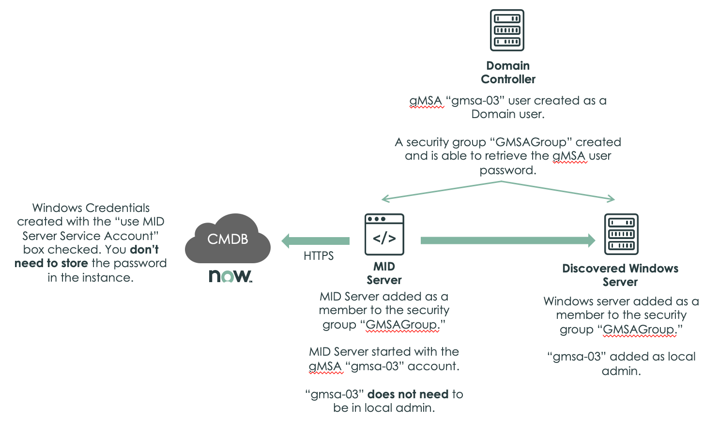
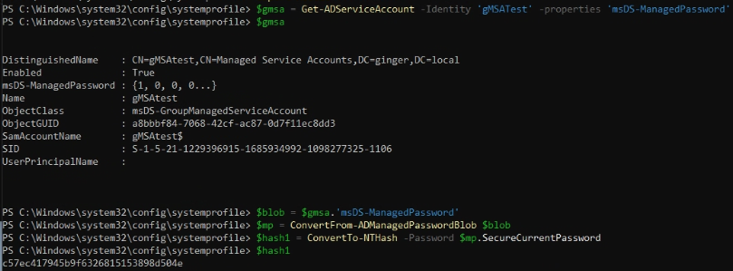

# gMSA_quick_writeup

gMSA or Group Manag
ed Service Accounts are amazing tools when used to solve the problems they were intended to solve. Since AD handles the account it becomes long and strong by default and automatically changes itself at a set interval. This helps out on the audit and the pentests.

At face value that looks great, however, it functions by allowing certain objects to query Active Directory to retrieve the password for use. This action isn't neccessarily bad, however as you can imagine in improper conditions this can quickly lead to abuse. 

Enter Service Now's Discovery Implementation using gMSA



In the article where this can be found the following benefits from gMSA are stated:

	- You don't have to handle gMSA passwords on your own (True)
	- You can choose the cycle og gMSA password rotation for better security(True)
	- You don't nee dto store the password on the ServiceNow instance (True)
	- The gMSA user doesn't need to be member of a domain admin group (True)
	- The gMSA user used as the MID Server service account doesn't need to be on the local admin group of the MID Server (Still true)

However, if you read the text under Domain Controller;

	- gmsa-03 user created as a Domain user (yep)
	- Security group "GMSAGroup" created and is able to retrieve the gMSA user password (that's how they work, no issues here)

Then the text under Discovered Windows Server;
	
	- Windows server added as a member to the security group "GMSAGroup"
	- "gmsa-03" added as a local admin

That's where the issue comes in. What you then have is a local admin on every Windows Server in the scope of Service Now Discovery where the password is retrievable by those same servers computer objects.

Exploitation

Honestly the exploitation is pretty easy although it does require administrative access to something inside the scope of Discovery. Here is an [article](https://adsecurity.org/?p=4367) from 2020 that explains the steps in the attack. When exploiting the Service Now Discovery gMSA implementation it SHOULD only be computer objects in the group, however if you have local administrative access to a system you just need to elevate to SYSTEM$, I used ```psexec -s -i powershell.exe``` personally.

Here's a screenshot of me doing just that in a test lab. 




